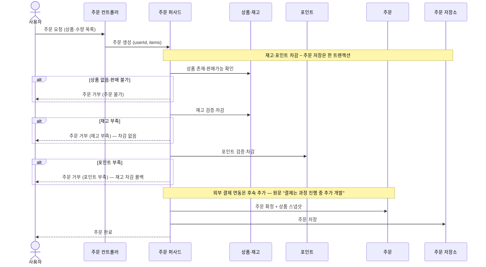
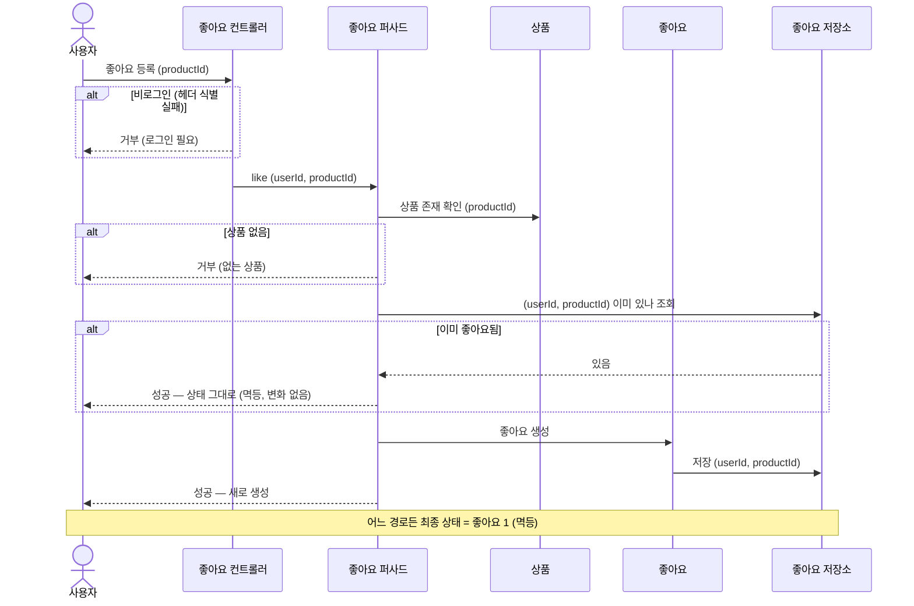
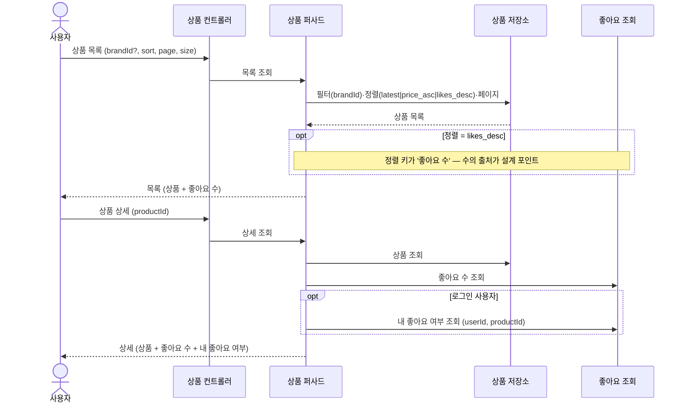
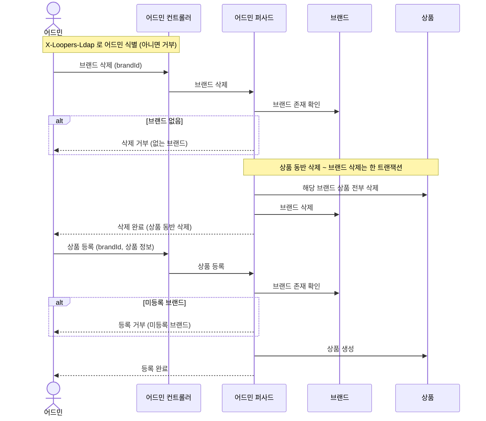

# 02. 시퀀스 다이어그램

> 근거: `01-requirements.md` §4. 네 영역을 다루되, 각 다이어그램은 설계 가치가 있는 지점에 집중한다(트리비얼 CRUD는 생략).
> 참여자명은 역할 기준이며, 실제 클래스명은 `03-class-diagram.md`에서 확정한다.

---

## 1. 주문 (재고·포인트 차감 / 외부 결제는 후속)

**왜 이 다이어그램인가** — 주문 요청이 상품 확인 → 재고 차감 → 포인트 차감 → 스냅샷·확정으로 이어지는 흐름과, 각 단계 실패 시 어디서 어떻게 롤백되는지를 드러내기 위해서다. 외부 결제 연동은 원문(`round2-scenario.md`)이 **"결제는 과정 진행 중, 추가로 개발"** 이라 명시하므로 후속 단계로 분리하고, 자리만 표시한다. (`01-requirements.md` §4.3)

**읽는 포인트**
- 재고·포인트는 차감 전에 검증한다 — 재고 부족 시 차감 없이 거부, 포인트 부족 시 이미 한 재고 차감을 롤백한다.
- 외부 결제 연동은 원문상 "과정 진행 중 추가 개발"이라 이 다이어그램에서는 제외하고 자리만 표시했다. 비가역 외부 결제를 차감 흐름 맨 뒤에 두는 이유와 실패 시 보상 처리는 결제 추가 시점에 다룬다.
- 주문 스냅샷은 "확정" 시점에 생성된다 — 이후 상품이 바뀌어도 주문은 그대로다.

**잠재 리스크 (선택지)**
- 동시 주문이 같은 상품 재고를 동시에 차감 → 초과 판매 가능.
  - 선택 A: 재고 차감을 조건부 원자적 갱신(재고 ≥ 수량일 때만 차감)
  - 선택 B: 비관/낙관 락
  - → 동시성은 원문상 추후 단계 → `04-erd.md`/구현에서 결정

---

## 2. 좋아요 멱등 토글

**왜 이 다이어그램인가** — "같은 요청을 여러 번 보내도 결과 상태가 0 또는 1"이라는 멱등 요구가 호출 흐름에서 어떻게 보장되는지, 그리고 비로그인·상품 없음 거부가 각각 **어느 책임 주체**에서 일어나는지 드러내기 위해서다. (`01-requirements.md` §4.2)

**읽는 포인트**
- 거부 책임이 갈린다: **비로그인**은 헤더 식별 실패라 좋아요 도메인까지 가기 전 **컨트롤러(진입점)** 에서 막고, **상품 없음**은 **상품 도메인**에 존재를 물어본 결과로 막는다. 좋아요 퍼사드가 둘 다 직접 판단하지 않는다.
- "존재하면 그대로 성공, 없으면 생성 후 성공" — 두 경로 모두 최종 상태가 1로 같다(멱등).
- 취소는 대칭: 없으면 변화 없이 성공, 있으면 삭제 후 성공(최종 0).
- 멱등의 기준 키는 `(userId, productId)` — 사용자 식별(로그인)이 전제.

**잠재 리스크 (선택지)**
- 동시 등록 두 건이 "존재 조회"를 동시에 통과 → 중복 INSERT 시도.
  - 선택 A: `(user_id, product_id)` 유니크 제약으로 막고, 위반을 멱등 성공으로 흡수
  - 선택 B: 비관/낙관 락
  - → 동시성 메커니즘은 `04-erd.md`/구현 단계 결정 (요구사항 단계에서는 멱등 결과만 보장)

---

## 3. 상품 목록·상세 조회

**왜 이 다이어그램인가** — 단순 조회처럼 보이지만 `likes_desc` 정렬과 상세의 "좋아요 수·본인 좋아요 여부" 노출이 **좋아요 수를 어디서 가져오나**라는 결정을 부른다. (`01-requirements.md` §4.1)

**읽는 포인트**
- 비로그인도 목록·상세가 가능하다. "내 좋아요 여부"만 로그인 시 추가된다.
- `likes_desc` 정렬과 상세 노출 둘 다 "좋아요 수"를 요구 — 이 수의 산출 방식이 핵심 결정.
- 필터·정렬·페이징은 조회 파라미터일 뿐, 도메인 상태를 바꾸지 않는다(읽기 전용).

**잠재 리스크 (선택지)**
- 좋아요 수의 출처.
  - 선택 A: 상품에 좋아요 수를 비정규화 컬럼으로 보관 (정렬·조회 빠름, 갱신 정합 관리 필요)
  - 선택 B: 매 조회 시 좋아요 테이블 집계(JOIN/COUNT) (정합 정확, 목록·정렬에서 비용)
  - → `03-class-diagram.md`/`04-erd.md`에서 결정 (요구사항 단계에서는 미정)

---

## 4. 어드민 — 브랜드 삭제·상품 등록 (핵심 제약)

**왜 이 다이어그램인가** — 어드민 CRUD 대부분은 트리비얼하나, **브랜드 삭제 시 상품 동반 삭제(cascade)** 와 **상품 등록 시 브랜드 기등록 검증** 은 책임·정합 결정을 부른다. 그 둘만 그린다. (`01-requirements.md` §4.4)

**읽는 포인트**
- 어드민 식별 실패는 진입에서 차단된다(가드).
- 브랜드 삭제는 "상품 동반 삭제 + 브랜드 삭제"가 한 트랜잭션 — 부분 삭제 금지.
- 상품 등록은 "브랜드 기등록"이 전제. 상품 수정 시 브랜드 변경 불가도 같은 검증의 변형이라 다이어그램은 생략.

**잠재 리스크 (선택지)**
- 브랜드에 상품이 많으면 대량 동반 삭제 → 트랜잭션·잠금 비대화.
  - 선택 A: 물리 삭제 일괄 (단순, 대량 시 부하)
  - 선택 B: 소프트 삭제 후 비동기 정리 (조회 일관성·정리 잡 필요)
  - → `04-erd.md`/구현에서 결정
