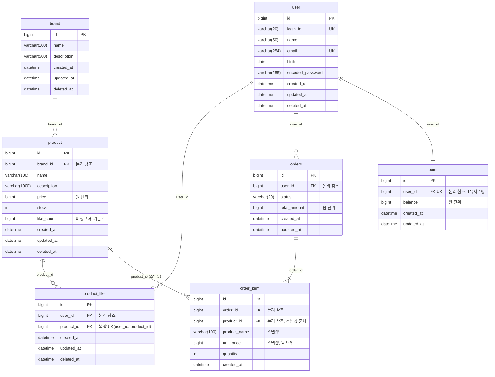

# 04. ERD

> 근거: `03-class-diagram.md`, `01-requirements.md` §4·§5. 도메인 모델을 테이블 구조로 옮긴다.

## 1. 표기 규약 & 공통 정책

- **논리 FK**: 관계선과 컬럼의 `FK`는 논리적 참조다. 물리적 외래키 제약(`FOREIGN KEY ... REFERENCES`)은 걸지 않으며, 참조 무결성은 애플리케이션(도메인·Facade)이 보장한다. JPA 연관 매핑(`@ManyToOne` 등)도 쓰지 않고 `Long id`로만 참조한다.
- **식별자**: 모든 테이블은 `id`(`bigint` PK, auto increment)를 가진다.
- **감사 컬럼은 테이블별로 필요한 것만 둔다.** `BaseEntity`는 `created_at`·`updated_at`·`deleted_at`을 모두 제공하지만, 테이블 성격에 맞춰 정리한다.
  - `deleted_at`(소프트 삭제): 삭제 대상인 `brand`·`product`·`product_like`만. `orders`·`order_item`·`point`는 삭제가 없어 두지 않는다.
  - `updated_at`: 행이 바뀌는 테이블만. `order_item`은 주문 시점 스냅샷이라 불변 → `created_at`만 둔다.
  - 구현 시 `deleted_at`이 없는 테이블은 `BaseEntity`의 `deleted_at`을 미사용으로 두거나, `deleted_at` 없는 슬림 베이스로 분리한다.
- **예약어**: `order`·`like`는 SQL 예약어라 테이블명을 `orders`·`product_like`로 둔다. 나머지는 단수형(`brand`, `product`, `point`).

타입·크기와 그 근거는 §4에 정리한다.

---

## 2. 전체 ERD

> `user`는 week1(volume-1) 산출물이라 참고용으로만 표기한다. 이번 설계에서 새로 만드는 테이블은 `brand`·`product_like`·`orders`·`order_item`·`point`이고, `product`는 기존 테이블에 `brand_id`·`like_count`를 더한다.

---

## 3. 제약 & 인덱스

| 테이블 | 유니크 | 인덱스 (쿼리 패턴) | 비고 |
| --- | --- | --- | --- |
| brand | — | — | 소프트 삭제 |
| product | — | `brand_id`(브랜드 필터), `like_count`(likes_desc 정렬), `price`(price_asc 정렬), `created_at`(latest 정렬) | `like_count` 비정규화 |
| product_like | `(user_id, product_id)` | `user_id`(내 좋아요 목록 조회) | 유니크가 곧 멱등 키 |
| orders | — | `(user_id, created_at)`(기간별 주문 목록 조회) | `status`는 varchar |
| order_item | — | `order_id`(주문 상세 로딩) | 스냅샷 컬럼 보유 |
| point | `user_id` | — | 한 유저당 한 행 |
| user | `login_id`, `email` | — | week1 산출물 |

정렬·필터 파라미터(`brandId`/`sort`/`page`/`size`)와 기간 조회(`startAt`/`endAt`)가 인덱스 설계의 기준이다. `likes_desc`를 비정규화 `like_count` 인덱스로 받기 때문에 정렬 시 좋아요 테이블을 집계하지 않는다.

---

## 4. 데이터 타입 & 크기 근거

**숫자**

| 타입 | 적용 컬럼 | 근거 |
| --- | --- | --- |
| `bigint` | `id`(PK/FK), `price`·`unit_price`·`total_amount`·`balance`, `like_count` | PK/FK는 대량 레코드 대비. 금액은 KRW 정수라 소수가 없고, 합계가 `int` 상한(약 21.4억)을 넘을 수 있어 `bigint`. `like_count`는 누적 카운터라 여유를 두고 도메인 필드(`long`)와 맞춘다 |
| `int` | `stock`, `quantity` | 단일 상품 재고·주문 수량은 `int`(약 21억)로 충분하고 공간을 아낀다 |
| `datetime` | `created_at`·`updated_at`·`deleted_at` | `BaseEntity`의 `ZonedDateTime` 매핑 |
| `date` | `user.birth` | 시각이 필요 없는 날짜 |

> 금액에 `decimal`을 쓰지 않는 이유: 원화는 소수 단위가 없어 정수로 충분하고, 기존 `ProductModel.price`도 `Long`이다.

**문자열 길이**

| 컬럼 | 길이 | 근거 |
| --- | --- | --- |
| `user.login_id` | `varchar(20)` | 기존 코드 컨벤션(`length = 20`) |
| `user.name` | `varchar(50)` | 기존 코드 컨벤션(`length = 50`) |
| `user.email` | `varchar(254)` | 기존 코드 컨벤션, 이메일 최대 길이 |
| `user.encoded_password` | `varchar(255)` | 인코딩 해시, 기본 길이 |
| `brand.name`·`product.name` | `varchar(100)` | 이름류 여유 |
| `order_item.product_name` | `varchar(100)` | `product.name`의 스냅샷이라 같은 길이 |
| `brand.description` | `varchar(500)` | 짧은 소개 |
| `product.description` | `varchar(1000)` | 상품 설명 여유. 현재 코드는 길이 미지정(기본 255)이라 구현 시 지정 필요 |
| `orders.status` | `varchar(20)` | enum 문자열(최대 9자) + 여유. enum은 코드 테이블 대신 varchar로 저장(가짓수가 적고 안정적) |

원칙: 기존 `user` 테이블 길이를 그대로 따르고, 신규 컬럼은 한 단계 보수적으로 잡되 과대 할당은 피한다. 금액·카운터는 오버플로 안전을 위해 `bigint`, 수량류는 `int`.

---

## 5. 정합성 & 설계 결정

- **좋아요 멱등**: `product_like`에 `UNIQUE(user_id, product_id)`. 취소는 소프트 삭제, 재등록은 복원으로 같은 행의 `deleted_at`만 토글한다. 유니크에 `deleted_at`을 넣지 않으므로 재삽입이 아니라 복원으로 처리한다.
- **브랜드 삭제 동반**: 물리 FK의 `ON DELETE`를 쓰지 않는다. BrandFacade가 소속 `product`를 같은 트랜잭션에서 소프트 삭제한다.
- **주문 스냅샷**: `order_item.product_name`·`unit_price`는 주문 시점의 복사본이다. 이후 `product`가 바뀌어도 주문 내역은 그대로 남는다. 합계(`lineAmount`)는 저장하지 않고 `unit_price * quantity`로 계산한다.
- **Order ↔ OrderItem**: `@OneToMany`/cascade를 쓰지 않는다. `order_item.order_id`로 논리 참조하고, 애그리거트는 리포지토리에서 `order_id`로 묶어 조립한다. (03에서 미뤄둔 매핑 결정)
- **포인트**: `point.user_id`에 유니크를 걸어 한 유저당 한 행을 보장한다. 차감만 하고 충전 컬럼/이력은 두지 않는다.
- **상태값**: `orders.status`는 enum을 varchar로 저장한다(`PENDING`/`COMPLETED`/`FAILED`).

---

## 6. 잠재 리스크 (선택지)

- 물리 FK가 없어 고아 레코드가 생길 수 있다(예: `product`가 삭제됐는데 `product_like`·`order_item`이 참조). 무결성을 앱에 의존하므로 조회 시 필터링하고, 필요하면 정리 잡으로 방어한다.
- `like_count` 비정규화는 동시 좋아요/취소에서 갱신 경쟁이 생긴다. 원자 갱신(`like_count = like_count ± 1`)이나 락은 동시성 단계에서 결정한다(범위 밖).
- `product_like` 소프트 삭제는 토글이 잦으면 행이 누적된다. 하드 삭제 또는 정리 잡이 대안이다(03의 Like 삭제 방식 선택과 연결).
- 스냅샷에 담을 항목은 현재 이름·단가까지다. 옵션·할인 등 추가 스냅샷이 필요해지면 `order_item` 컬럼을 확장한다.
